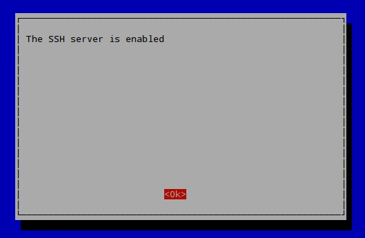

# RPi_LIRC

Light switch controller using Raspberry Pi

This project focuses on providing simple instructions and code on turning your Raspberry Pi into a light switch controller. Much of this project has been developed from resources found on the Internet but we hope to make it even easier for folks by providing all instructions in plain non-techie language so anyone can get up to speed with these instructions. Each section will have an TL:DR for those who want to get up and running ASAP. 

__Disclaimer: By continuing reading, following, pulling, or utilizing any aspects of the content provided in this Git you hold MouseApps and their developers harmless of any damage realized as a result from this guide__

___

## Objective

Turn your Raspberry Pi into an IR controller for your Lutron light switch.

## Audience

Those who want to turn a Raspberry Pi into a controller for your light switch. Reasonable knowledge of technology and common computing terms.

## Let's get started with a Mac or (PC with PuTTY)

### Step 1: Obtain Hardware

We have tested this guide with the following hardware:

Stuff You'll Need:

* Raspberry Pi2 B [(Link to Amazon - let us know if this works on a Pi3 and we'll update the link)] (<https://www.amazon.com/Raspberry-Pi-Model-Desktop-Linux/dp/B00T2U7R7I/ref=sr_1_3?s=electronics&ie=UTF8&qid=1499172596&sr=1-3&keywords=pi+>)
* IR Board [(here is the on we used)](https://www.amazon.com/Infrared-Shield-RPi/dp/B01C2AQL62/ref=sr_1_1?s=electronics&ie=UTF8&qid=1499172489&sr=1-1&keywords=pi+ir>)
* Power cable
* Ethernet cable or WiFi dongle
* Mouse (just to install OS and turn on SSH)
* MicroSD card with latest version of Raspian
* Diet Dr. Pepper, Turkish Coffee, Pilsner, or other favorite tinkering beverage
* Mac or PC with PuTTY
* 30 minutes to 1 hour

TL:DR Get your Pi all wired up and ready to go with a separate computer handy for SSH'ing

### Step 2: Boot Pi to OS Install Screen and install the latest Raspian

We won't go into too much detail here as this has been covered ad nauseum on the Internet. [(Click here if you have yet to install Raspbian and get to the Pi Desktop)](<http://lmgtfy.com/?q=How+to+install+Raspian+on+Raspberry+pi>)

TL:DR Google it

### Step 3: Go Headless (Enable SSH) and Connect to WIFI

At this point, you probably have your Pi in an inconvenient location to get this far due to needing a monitor, keyboard, mouse and such. This step will allow you to move your Pi into a more convenient location such a bookshelf, nightstand, garage, wine cellar (hopefully you have the Wifi USB dongle) and control the Pi remotely from Secure Shell or SSH.

How to enable SSH:
* Click on the Terminal icon on the top left hand corner of the Raspberry GUI (You can do this through the GUI but this will get us used to using Terminal) 
* Type in the following command   `sudo raspi-config`
* Push down arrow key until "Interfacing Options" is highlighted and push the Enter key
* Push down arrow key until SSH is highlighted and push the Enter key
* Push Enter again 
* You should see this 
* If you are connecting via WiFi, be sure to configure the Pi to connect to your router as this will make it impossible to go headless once you unplug everything
* Sip Beer, shut down Pi, and move the Pi to a more convenient location that has line of sight to your IR device

TL:DR Boot to Desktop, enable SSH, shutdown and move to convenient location

### Step 4: Attach IR board

I don't think there would be any impact of having the board attached through steps 1-3 but we held off until SSH was enabled to plug it in. Keeping it wrapped in the bubble wrap kept it safe from splashes. To attach the board, simply sandwich the two together - shouldn't take too much effort so __dont force it__.

TL:DR S'mores

### Step 5: Attach power to Pi and connect via SSH

SSH'ing into the Pi will allow you to contorl the Pi via command line just like how we did it in Step 3. This allows you to run your Pi "Headless", meaning no monitor or keyboad attached to it. This is helpful for our build because we generally won't have a monitor or keyboard attached to this device.

How to connect to Pi via SSH:

* Plug Pi into power source which will turn Pi on
* 

* Type in the following command   `sudo apt-get update`
* Then type in the following command   `sudo apt-get dist-upgrade` (sip coffee)

todo: clean install of raspian with head
go headless with ssh
unplug and place in room with internet connection and plug into ir module 
apt-get dist-upgrade
apt-get update

aptget intsall lirc
aptet (lamp stack)
